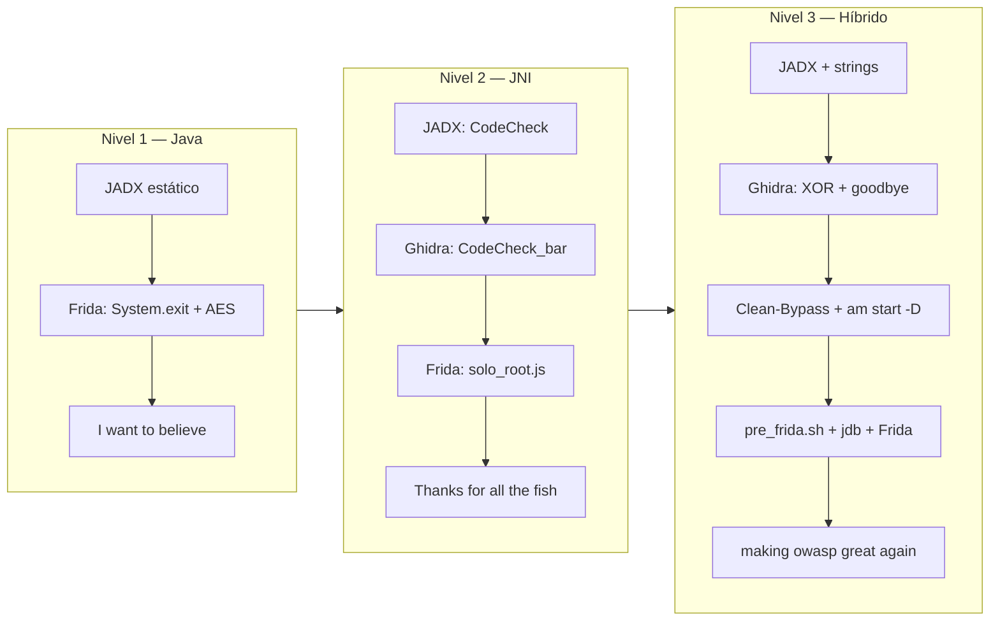

# Memoria de resolución — OWASP Uncrackable (Android)

**Autor:** Alejandro Quiñones Gámez  
**Asignatura:** PPS — Puesta a Producción Segura  
**Práctica:** Android Inverse — MAS Crackmes  
**Repositorio:** [github.com/alejandroquinonesgamez/Uncrackables](https://github.com/alejandroquinonesgamez/Uncrackables)  
**Enunciado:** [crackme.html](crackme.html)

---

## 1. Introducción

El objetivo de la presente memoria es documentar el proceso de auditoría y la obtención de las contraseñas ocultas en las aplicaciones de la serie OWASP Uncrackable (Niveles 1, 2 y 3), detallando de forma exhaustiva la metodología técnica empleada para alcanzar cada solución. Las evidencias visuales del proceso se encuentran disponibles en el directorio [Capturas/](https://github.com/alejandroquinonesgamez/Uncrackables/tree/main/Capturas).

Los tres retos se abordaron de forma secuencial (L1 → L2 → L3), dado que cada nivel introduce nuevas capas de ofuscación y defensa. El primer nivel basa su seguridad en comprobaciones nativas de Java; el segundo traslada la validación a una librería compilada en C/C++ (`libfoo.so`); y el tercero implementa un sistema de defensa multicapa que combina controles de integridad, detección de instrumentación en memoria (Frida), un hilo guardián reactivo y validación criptográfica mediante XOR.

| Nivel | Paquete | Contraseña |
|-------|---------|------------|
| 1 | `owasp.mstg.uncrackable1` | `I want to believe` |
| 2 | `owasp.mstg.uncrackable2` | `Thanks for all the fish` |
| 3 | `owasp.mstg.uncrackable3` | `making owasp great again` |

Para la consecución de los objetivos se empleó el siguiente conjunto de herramientas: **Genymotion** y `adb` para el despliegue del entorno emulado; **JADX-GUI** para la descompilación y análisis estático del *bytecode* Dalvik; **Ghidra** para la ingeniería inversa de los binarios nativos ELF; **Frida** para la instrumentación dinámica de código en tiempo de ejecución; y **jdb** (Java Debugger) junto a utilidades de sistemas Unix (`strings`, `unzip`) para la evasión de medidas anti-análisis en el nivel superior.



---

## 2. Nivel 1 — Android Uncrackable L1

**APK:** `UnCrackable-Level1.apk` · **Paquete:** `owasp.mstg.uncrackable1` · **Contraseña:** `I want to believe`

### Preparación del entorno

Antes de tocar el código, prepararemos el emulador Genymotion (dispositivo tipo Pixel), instalaremos la APK con `adb` y comprobaremos que Frida pueda hablar con el dispositivo. En la captura siguiente vemos ese punto de partida: emulador encendido, terminal con los comandos de instalación y la lista de procesos con Frida.


### Análisis estático con JADX

Abriremos la APK con `jadx-gui UnCrackable-Level1.apk`. En la imagen se aprecia el comando en la terminal y la ventana de JADX con el árbol del proyecto; en los logs aparece que se han cargado unas quince clases, señal de que la descompilación ha ido bien y ya se puede navegar por `sg.vantagepoint`.


Al inspeccionar la clase `sg.vantagepoint.uncrackable1.MainActivity`, se observa que el método `onCreate` implementa rutinas de evasión. Antes de permitir la interacción, se invocan los métodos `c.a()`, `c.b()` y `c.c()` para verificar la presencia de permisos de superusuario (root), y `b.a(...)` para determinar si la aplicación se encuentra en modo depurable. Si alguna comprobación resulta positiva, se genera un `AlertDialog` que fuerza el cierre del proceso mediante `System.exit(0)`. Posteriormente, en el método `verify`, la validación del secreto se delega a una clase externa mediante la instrucción `if (a.a(string))`.


En la siguiente captura podemos ver la lógica real de validación reside en el método `a(String str)` de la clase `sg.vantagepoint.uncrackable1.a`. El programa no compara la entrada con un texto en claro; en su lugar, descifra un bloque de datos mediante la función `sg.vantagepoint.a.a.a(...)`. Dicha función recibe una clave estática codificada en hexadecimal (`8d127684cbc37c17616d806cf50473cc`) y un texto cifrado en Base64 (`5UJiFctbmgbDoLXmpL12mkno8HT4Lv8dlat8FxR2G0c=`), comparando el array de bytes resultante con la cadena introducida por el usuario.


Para confirmar el algoritmo, abriremos `sg.vantagepoint.a.a` en el paquete auxiliar `sg.vantagepoint.a`. En la captura siguiente aparece `AES/ECB/PKCS7Padding`, `Cipher.getInstance("AES")` y `cipher.init(2, ...)`, es decir, modo descifrado. Con esto fijaremos el objetivo del hook de Frida: `sg.vantagepoint.a.a.a`.


También revisaremos las clases que explican por qué la app se cierra en un emulador rooteado. En la captura de la clase `b`, el método `a(Context)` comprueba `(context.getApplicationInfo().flags & 2) != 0`, el flag `FLAG_DEBUGGABLE`. En la de la clase `c`, que es la más reveladora para el diálogo de root, hay tres comprobaciones: en `a()` recorre el `PATH` del sistema buscando el binario `"su"`; en `b()` mira si `Build.TAGS` contiene `"test-keys"`; en `c()` recorre rutas típicas de Superuser (`/system/app/Superuser.apk`, `daemonsu`, etc.). Cuando leímos esto en JADX, encajó con el mensaje *Root detected!* que vimos después al ejecutar la app.


### Script de Frida y ejecución en el emulador

Para evadir estas restricciones y extraer el secreto, se desarrolló un script de instrumentación dinámica en JavaScript ([Scripts/Crackable-Level1.js](https://github.com/alejandroquinonesgamez/Uncrackables/blob/main/Scripts/Crackable-Level1.js)). La solución (Captura 10) redefine el comportamiento de `System.exit` para anular la finalización del proceso tras la detección de *root*, e intercepta la función de descifrado `sg.vantagepoint.a.a.a` con el fin de volcar en la consola los bytes resultantes en formato de texto claro.


```javascript
Java.perform(function () {
    var System = Java.use('java.lang.System');
    System.exit.implementation = function (code) {
        console.log("[+] Intento de cierre bloqueado.");
    };
    var aesDecrypt = Java.use('sg.vantagepoint.a.a');
    aesDecrypt.a.implementation = function (key, encrypted) {
        var result = this.a(key, encrypted);
        var secret = "";
        for (var i = 0; i < result.length; i++) {
            secret += String.fromCharCode(result[i]);
        }
        console.log("[!] LA CLAVE SECRETA ES: " + secret);
        return result;
    };
});
```

Al ejecutar la herramienta mediante el comando `frida -U -f owasp.mstg.uncrackable1 -l Scripts/Crackable-Level1.js`, el motor se acopla al hilo principal del proceso en el dispositivo emulado. A pesar de que la aplicación despliega el aviso *Root detected!*, la modificación en memoria impide que la interacción con el botón "OK" destruya el proceso.


### Obtención y comprobación de la contraseña

A continuación, se introdujo una cadena arbitraria ("Probando") en el campo de texto para forzar la ejecución de la rutina de verificación.


Como resultado, la interfaz gráfica responde con un mensaje de denegación ("Nope..."); sin embargo, la interceptación dinámica en la terminal captura el flujo interno del algoritmo AES, exponiendo la contraseña legítima: `I want to believe`.


Finalmente, la introducción de dicho valor en el formulario de la aplicación devuelve el estado de validación correcta ("Success! This is the correct secret."), confirmando la resolución del primer nivel.


---

## 3. Nivel 2 — Android Uncrackable L2

**APK:** `UnCrackable-Level2.apk` · **Paquete:** `owasp.mstg.uncrackable2` · **Contraseña:** `Thanks for all the fish`

En este nivel la validación **deja de estar en Java** y pasa a la librería nativa `libfoo.so`. Usaremos JADX para ver el puente y Ghidra para leer la comparación real.

### Instalación y análisis estático inicial

Se procedió a instalar la aplicación en el dispositivo emulado y a realizar su descompilación mediante la herramienta JADX.


La revisión de la clase principal, `MainActivity`, revela que el método `onCreate` mantiene las comprobaciones de *root* y depuración observadas en el nivel anterior, añadiendo además una tarea asíncrona (`AsyncTask`) que monitoriza constantemente la conexión de un depurador mediante `Debug.isDebuggerConnected()`. Por su parte, la rutina `verify` delega la comprobación del secreto introducido por el usuario en el método `a(String)` de un objeto instanciado a partir de la clase `CodeCheck`.


A diferencia del primer reto, la validación criptográfica no se encuentra de forma íntegra en Java. La clase `MainActivity` declara un bloque estático encargado de cargar la librería compartida `libfoo.so` mediante la instrucción `System.loadLibrary("foo")`, así como un método nativo de inicialización `private native void init()`.


Al inspeccionar la clase `CodeCheck`, se confirma que el método `a(String)` se limita a convertir la cadena de texto a un *array* de bytes y a invocar la función `private native boolean bar(byte[] bArr)`. El uso de la palabra reservada `native` indica que la lógica de comparación reside en el binario compilado.


Para auditar dicha función, se extrajo el contenido del paquete APK utilizando la utilidad `unzip`, aislando las librerías nativas correspondientes a cada arquitectura para su posterior análisis.


### Análisis de libfoo.so en Ghidra

Para realizar el análisis estático del componente nativo, se inicializó un entorno de trabajo en Ghidra y se importó el archivo `libfoo.so`.


Durante la importación, la herramienta reconoció correctamente la estructura del ejecutable, asignándole el formato ELF (*Executable and Linking Format*) y determinando la arquitectura nativa correspondiente (AARCH64) para proceder con el análisis.


Una vez finalizado el proceso de descompilación automática, se inspeccionó el árbol de símbolos de exportación (*Exports*). En esta sección se logró identificar la nomenclatura estándar empleada por la interfaz JNI, localizando la función de inicialización `Java_sg_vantagepoint_uncrackable2_MainActivity_init` y la rutina de validación `Java_sg_vantagepoint_uncrackable2_CodeCheck_bar`.


Al examinar el pseudocódigo generado para la función `CodeCheck_bar`, el flujo de validación principal quedó expuesto en texto claro. La rutina reserva un búfer local de memoria e invoca la instrucción `strncpy` para almacenar en él la cadena `"Thanks for all the fish"`. Posteriormente, evalúa la entrada proporcionada por el usuario mediante una llamada a `strncmp`, comparando un máximo de 23 caracteres (`0x17`).


Este hallazgo permitió obtener la contraseña directamente mediante análisis estático del binario, demostrando que en este nivel el secreto no se encuentra ofuscado en memoria ni derivado dinámicamente.

### Comprobación de la contraseña en el dispositivo

A pesar de haber extraído la contraseña mediante análisis estático, la ejecución de la aplicación en un entorno emulado rooteado provoca el cierre inmediato del proceso debido a las rutinas de evasión implementadas en Java. Para verificar el hallazgo, se elaboró un script de Frida de carácter mínimo (`solo_root.js`) diseñado exclusivamente para interceptar y anular la llamada a `System.exit`.


Tras localizar el identificador del proceso mediante `frida-ps -Uai`, se inyectó el script en el paquete `owasp.mstg.uncrackable2`. La instrumentación permitió que la aplicación continuara su ejecución normal, mostrando el diálogo de advertencia de *root* sin llegar a finalizar el proceso, al igual que con el L1.


Una vez neutralizada la protección inicial, se introdujo en el campo de texto la cadena descubierta en la función nativa durante el análisis en Ghidra: *Thanks for all the fish*.


Al pulsar el botón de verificación, la aplicación devolvió el diálogo *"Success!"*, corroborando de manera práctica que la cadena ofuscada estáticamente en `libfoo.so` corresponde a la solución legítima del segundo nivel.


---

## 4. Nivel 3 — Android Uncrackable L3

**APK:** `UnCrackable-Level3.apk` · **Paquete:** `owasp.mstg.uncrackable3` · **Contraseña:** `making owasp great again`

Aquí las defensas aumentan: comprobación de integridad (CRC de `libfoo.so` y `classes.dex`), detección de Frida leyendo `/proc/self/maps`, hilo anti-debug en Java, función nativa `goodbye()` que aborta el proceso, y validación del secreto con XOR usando la clave `pizzapizzapizzapizzapizz`. Este nivel se resolvió de forma iterativa, con varios scripts que fallaron antes de que se encontrara la combinación que funcionó.

### Reconocimiento inicial y análisis estático

La fase inicial consistió en la instalación del paquete y la extracción de los binarios nativos para su posterior análisis.


El análisis de la clase `MainActivity` revela un incremento significativo en las capas de seguridad respecto a los retos anteriores. Se identificó la declaración de una constante `xorkey` con el valor `"pizzapizzapizzapizzapizz"`(24 bytes), así como una función `verifyLibs()` encargada de validar la integridad del código mediante comprobaciones CRC contra las librerías nativas y el archivo `classes.dex`. Si se detecta alguna anomalía, se altera la variable `tampered`.


La inicialización de la librería nativa recibe la constante `xorkey` convertida a *array* de bytes. Asimismo, se observó la ejecución de un hilo en segundo plano (`AsyncTask`) que evalúa de forma recurrente el estado de depuración. Cualquier intento de inyección, *tampering* o depuración desencadena un diálogo de alerta antes de permitir la interacción con el formulario.


De forma análoga al nivel anterior, la verificación final de la contraseña se deriva a una clase externa, `CodeCheck`, la cual actúa como puente (*wrapper*) hacia una función nativa denominada `bar(byte[])`.


Previo al análisis en el desensamblador, la ejecución del comando `strings` sobre `libfoo.so` expuso una serie de cadenas críticas para entender el modelo de amenaza. Entre ellas figuran referencias a herramientas de instrumentación dinámica (`frida`, `xposed`), rutas de memoria del sistema (`/proc/self/maps`), un mensaje de terminación por manipulación y el símbolo ofuscado de una función denominada `goodbye`.


Se continuó con la importación de libfoo.so en Ghidra para su análisis:


### Evaluación dinámica y crash del hilo guardián

Para contrastar las defensas identificadas estáticamente, se intentó instrumentar el proceso inyectando el script básico de evasión desarrollado en el nivel anterior. Al realizar el *spawn*, la aplicación abortó inmediatamente su ejecución lanzando una señal de interrupción crítica (`Trace/BPT trap`).


La inspección de las trazas de ejecución (*backtrace*) reveló que la finalización forzada no provenía de las excepciones de Java, sino de un hilo nativo creado mediante `pthread_start` que culminaba en la ejecución de la función `goodbye()`. Esto confirmó lo que intuimos al analizar el `strings`: la presencia de un hilo guardián encargado de detectar la intrusión de Frida en el mapa de memoria y el cierre forzado de la aplicación de manera irremediable.


### Análisis profundo de la lógica nativa en Ghidra

La búsqueda exhaustiva de la cadena `frida` en el código desensamblado condujo a una subrutina dedicada. El diagrama de flujo y la descompilación de esta función revelaron la mecánica exacta del hilo guardián: un bucle infinito que abre el archivo `/proc/self/maps` mediante `fopen`, lee su contenido línea a línea y utiliza `strstr` para identificar las secuencias `frida` o `xposed`. De encontrarlas, invoca de inmediato la instrucción `goodbye()`.


En paralelo, se auditaron las funciones JNI declaradas en Java. En `MainActivity_init`, la lógica de la rutina emplea `strncpy` para volcar 24 bytes (el tamaño exacto de la constante `xorkey`) en una dirección de memoria global.


Por su parte, la función de validación `CodeCheck_bar` no ejecuta una comprobación de cadenas tradicional. En su lugar, el descompilador expone un bucle iterativo de 24 ciclos (`0x18`) que aplica una operación lógica XOR byte a byte entre la entrada proporcionada por el usuario y la clave almacenada en memoria, validando el resultado.


### Intentos de instrumentación avanzada

Conociendo las rutinas a neutralizar, se desarrolló un script más elaborado (`Crackable-Level3.js`) con el propósito de interceptar `strstr` para ocultar las cadenas prohibidas del mapa de memoria, además de aplicar un *hook* sobre `strncpy` para exfiltrar la clave.


No obstante, la inyección de este código resultó infructuosa, devolviendo un error en la evaluación del motor de instrumentación y permitiendo que la ejecución del hilo guardián continuara hasta colapsar nuevamente el proceso. Este resultado forzó un cambio definitivo de estrategia.


### Neutralización de las protecciones: Bypass de memoria y anti-debugging

Ante la imposibilidad de evadir el hilo guardián en tiempo de ejecución de forma convencional, se documentaron múltiples pruebas de concepto intermedias que resultaron inestables. Inicialmente, se intentó bloquear la creación del hilo nativo y falsificar la lectura del mapa de memoria redirigiendo las llamadas `fopen` y `open` hacia una copia limpia del fichero `/proc/self/maps`, extraída previamente del entorno mediante comandos de terminal.


La principal barrera de estas estrategias residía en una condición de carrera (*race condition*): las rutinas protectoras nativas se inicializaban a una velocidad superior a la capacidad del motor de instrumentación para acoplarse e inyectar los *hooks*.

Para solventar este problema de sincronización, se optó por suspender el proceso desde su nacimiento. Mediante el uso del comando `adb shell am start -D`, se forzó el inicio de la máquina virtual Dalvik en modo depuración (*Waiting For Debugger*), congelando la ejecución antes de la carga inicial de las librerías compartidas.


En este estado de suspensión temporal, se diseñó el script definitivo de evasión ([Scripts/Clean-Bypass.js](https://github.com/alejandroquinonesgamez/Uncrackables/blob/main/Scripts/Clean-Bypass.js)). Esta solución anula de raíz las comprobaciones lógicas de la clase `RootDetection`, neutraliza `System.exit` y emplea un interceptor sobre la función `dlopen` del sistema operativo. Al detectar la carga en memoria de `libfoo.so`, el script calcula dinámicamente el puntero de la función nativa `goodbye` y sobrescribe su primera instrucción con una directiva de retorno incondicional (`RET`, valor hexadecimal `0xC3`), cegando al hilo guardián de forma permanente y segura sin interrumpir el flujo de la aplicación.


Para garantizar la efectividad del parche antes de que el proceso ejecute sus subrutinas de protección nativas, se forzó la detención del hilo principal mediante la redirección del puerto JDWP empleando `adb forward tcp:12345 jdwp:<pid>`. Al intentar acoplar Frida en este punto intermedio antes de la reanudación del entorno Java, el motor de instrumentación no logra localizar el proceso inicializado de forma correcta, confirmando la necesidad de coordinar ambas herramientas en un único vector de ataque.


Con el fin de automatizar esta compleja secuencia de sincronización, se desarrolló un script en Bash ([Scripts/pre_frida.sh](https://github.com/alejandroquinonesgamez/Uncrackables/blob/main/Scripts/pre_frida.sh)). La herramienta automatiza de forma secuencial el arranque suspendido de la aplicación, extrae el identificador del proceso dinámicamente mediante `pidof`, levanta el túnel de depuración JDWP en el puerto local y efectúa la inyección de Frida por PID en el instante exacto en el que el operador conecta el depurador de Java (`jdb -attach localhost:12345`) desde una terminal paralela. El script incorpora además un *hook* sobre `strncmp` configurado para inspeccionar y volcar los operandos en memoria RAM únicamente cuando la longitud de la comparación equivale a 24 bytes (la longitud de la cadena de `pizzapizzapizzapizzapizz`).


### Descifrado de la rutina criptográfica XOR en Ghidra

En paralelo a la construcción del entorno de ejecución, se profundizó en el análisis estático de la clase `MainActivity_init` en el descompilador de Ghidra para comprender la derivación del secreto.


La inspección de la subrutina nativa expone que, de forma previa a la manipulación de las claves, el binario ejecuta una llamada oculta hacia la función `FUN_00103910`.


Al auditar dicha función, se descubrió el mecanismo de evasión nativo más agresivo del reto. La aplicación efectúa un `fork()` para bifurcar el proceso y ejecuta `ptrace(PTRACE_ATTACH, ...)` sobre el proceso padre con el fin de monitorizarlo y bloquear la conexión de depuradores externos. Si esta acción es interceptada, la rutina levanta un hilo persistente mediante `pthread_create` diseñado para forzar la terminación del programa ante cualquier anomalía en la memoria.


Una vez comprendido el comportamiento de la bifurcación, se aislaron y renombraron las variables globales involucradas en la inicialización criptográfica (originalmente etiquetadas como `DAT_00107040`), identificándolas cronológicamente como `pizza` y, finalmente, como `cadena_Copiada`.


El análisis del pseudocódigo en la función de verificación de `CodeCheck_bar` evidenció que el programa ejecuta una operación lógica XOR condicional byte a byte. El algoritmo itera a lo largo de 24 ciclos comprobando si la entrada del usuario difiere del resultado de evaluar los caracteres ofuscados estáticos en el binario contra el búfer de inicialización que contiene la clave conocida `"pizzapizzapizzapizzapizz"`.


Para reconstruir la contraseña de manera externa si fuese necesario, se localizaron las direcciones de memoria exactas de los punteros y las constantes estructuradas dentro de las secciones de datos del archivo ELF, obteniendo los vectores de inicialización requeridos para revertir la ofuscación de forma estática.


### Obtención de la clave en consola y resolución del reto

La ejecución coordinada del script de automatización permitió burlar los hilos de integridad y el guardián de memoria nativo de forma definitiva. Al introducir una cadena de prueba en el formulario interactivo de la aplicación, el interceptor acoplado a la función de comparación en la librería `libfoo.so` capturó los argumentos directamente desde los registros de la memoria RAM.


Como resultado, la terminal expuso en texto plano los 24 bytes que componen el secreto del tercer nivel: `making owasp great again`. Tras introducir dicha clave en la interfaz gráfica de la aplicación, el flujo Dalvik validó con éxito el paquete de datos, desplegando el diálogo de confirmación que certifica la resolución completa del desafío de ingeniería inversa.

---

## 5. Conclusiones

La resolución progresiva de los tres niveles de OWASP Uncrackable ha permitido auditar de manera práctica la evolución de los mecanismos de protección en entornos Android, transitando desde validaciones básicas en el espacio de usuario de Java hasta complejas protecciones híbridas en código nativo (C/C++).

Se ha evidenciado que, si bien la delegación de la lógica de seguridad hacia librerías compiladas (`.so`) e hilos dinámicos antiprecinto incrementa significativamente la dificultad del análisis estático, la instrumentación dinámica avanzada combinada con técnicas de depuración a bajo nivel permite interceptar y manipular el comportamiento del sistema operativo.

La efectividad de las defensas analizadas no reside en la imposibilidad de su ruptura, sino en el tiempo y los recursos que el analista debe invertir para sincronizar vectores de ataque complejos, tales como la neutralización de condiciones de carrera mediante la suspensión del ciclo de vida del proceso en su nacimiento.

---

## 6. Referencias

- [Repositorio del proyecto](https://github.com/alejandroquinonesgamez/Uncrackables) — memoria, capturas, scripts y APKs
- [Enunciado de la práctica](crackme.html)
- [OWASP MAS Crackmes — Android](https://mas.owasp.org/crackmes/Android/)
- APKs del repositorio oficial de OWASP: [Level 1](https://github.com/OWASP/mastg/raw/master/Crackmes/Android/Level_01/UnCrackable-Level1.apk), [Level 2](https://github.com/OWASP/mastg/raw/master/Crackmes/Android/Level_02/UnCrackable-Level2.apk), [Level 3](https://github.com/OWASP/mastg/raw/master/Crackmes/Android/Level_03/UnCrackable-Level3.apk)
- Scripts de instrumentación desarrollados: [Crackable-Level1.js](https://github.com/alejandroquinonesgamez/Uncrackables/blob/main/Scripts/Crackable-Level1.js), [solo_root.js](https://github.com/alejandroquinonesgamez/Uncrackables/blob/main/Scripts/solo_root.js), [Crackable-Level3.js](https://github.com/alejandroquinonesgamez/Uncrackables/blob/main/Scripts/Crackable-Level3.js), [Clean-Bypass.js](https://github.com/alejandroquinonesgamez/Uncrackables/blob/main/Scripts/Clean-Bypass.js) y [pre_frida.sh](https://github.com/alejandroquinonesgamez/Uncrackables/blob/main/Scripts/pre_frida.sh).
