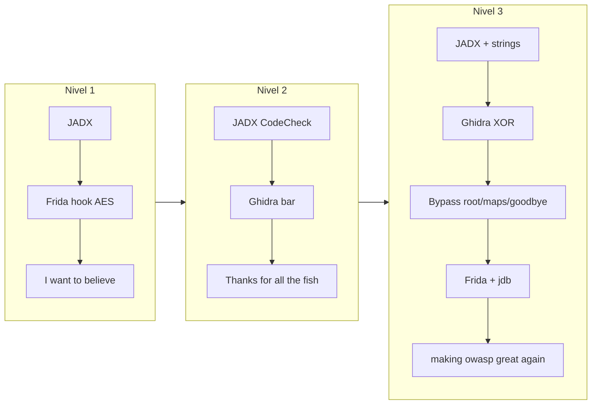

# Memoria de resolución — OWASP Uncrackable (Android)

**Asignatura:** PPS — Puesta a Producción Segura  
**Práctica:** Android Inverse — MAS Crackmes  
**Enunciado:** [crackme.html](crackme.html)

---

## 1. Introducción

El objetivo de esta práctica es obtener la contraseña oculta en cada una de las aplicaciones OWASP Uncrackable (niveles 1, 2 y 3) y explicar **cómo** hemos llegado a la solución, no solo el resultado. Las capturas del proceso están en [Capturas/](https://github.com/alejandroquinonesgamez/Uncrackables/tree/main/Capturas).

Abordamos los tres retos **en orden** (L1 → L2 → L3): cada nivel añade capas de defensa. El primero es casi todo Java; el segundo mueve la validación a código nativo en `libfoo.so`; el tercero combina integridad, detección de Frida, un hilo guardián que lee `/proc/self/maps` y una comprobación del secreto mediante XOR.

| Nivel | Paquete | Contraseña |
|-------|---------|------------|
| 1 | `owasp.mstg.uncrackable1` | `I want to believe` |
| 2 | `owasp.mstg.uncrackable2` | `Thanks for all the fish` |
| 3 | `owasp.mstg.uncrackable3` | `making owasp great again` |

Herramientas que utilizamos: Genymotion y `adb` para el dispositivo; **JADX-GUI** para descompilar el Java; **Ghidra** para el nativo; **Frida** para instrumentar en ejecución; en el nivel 3 también **jdb** y utilidades como `strings` y `unzip`.



En el texto, cada vez que decimos *«en la captura siguiente»* o *«en las siguientes imágenes»*, la captura aparece **justo debajo** del párrafo que la comenta.

---

## 2. Nivel 1 — Android Uncrackable L1

**APK:** `UnCrackable-Level1.apk` · **Paquete:** `owasp.mstg.uncrackable1` · **Contraseña:** `I want to believe`

### Preparación del entorno

Antes de tocar el código, preparamos el emulador Genymotion (dispositivo tipo Pixel), instalamos la APK con `adb` y comprobamos que Frida podía hablar con el dispositivo. En la captura siguiente vemos ese punto de partida: emulador encendido, terminal con los comandos de instalación y, si todo va bien, sin errores de conexión al listar procesos con Frida.


### Análisis estático con JADX

Abrimos la APK con `jadx-gui UnCrackable-Level1.apk`. En la imagen apreciamos el comando en la terminal y la ventana de JADX con el árbol del proyecto; en los logs aparece que se han cargado unas quince clases, señal de que la descompilación ha ido bien y ya se puede navegar por `sg.vantagepoint`.


Nos dirigimos a `sg.vantagepoint.uncrackable1.MainActivity`:

En la captura siguiente vemos el `onCreate`. Antes de dejar usar la app, llama a `c.a()`, `c.b()` y `c.c()` para comprobar root, y a `b.a(...)` para ver si la aplicación está en modo depurable. Si detecta root, entra en el método `a("Root detected!")` o mensajes similares y monta un `AlertDialog` cuyo botón OK ejecuta `System.exit(0)`. Más abajo, en `verify`, la línea importante es `if (a.a(string))`: ahí delega la comprobación del secreto en otra clase, no en la actividad principal.


La captura que sigue amplía la misma clase: en `verify` vemos las ramas que muestran *Success!* o *Nope...* según el resultado de `a.a(string)`, y en el método `a(String)` el diálogo que cierra la aplicación. La interfaz solo refleja un booleano; el valor del secreto no está aquí.


La pista concreta está en `sg.vantagepoint.uncrackable1.a`. En las dos capturas siguientes vemos el método `a(String str)`: no compara con una cadena fija en claro, sino que primero descifra un blob con `sg.vantagepoint.a.a.a(...)` usando una clave en hexadecimal (`8d127684cbc37c17616d806cf50473cc`, dieciséis bytes para AES-128) y un ciphertext en Base64 (`5UJiFctbmgbDoLXmpL12mkno8HT4Lv8dlat8FxR2G0c=`), y después hace `str.equals(new String(bArrA))`. Con esos dos valores podríamos descifrar la contraseña fuera del móvil; en esta práctica la obtuvimos interceptando esa llamada en ejecución.


Para confirmar el algoritmo, abrimos `sg.vantagepoint.a.a` en el paquete auxiliar `sg.vantagepoint.a`. En la captura siguiente aparece `AES/ECB/PKCS7Padding`, `Cipher.getInstance("AES")` y `cipher.init(2, ...)`, es decir, modo descifrado. Con esto fijamos el objetivo del hook de Frida: `sg.vantagepoint.a.a.a`.


También revisamos las clases que explican por qué la app se cierra en un emulador rooteado. En la captura de la clase `b`, el método `a(Context)` comprueba `(context.getApplicationInfo().flags & 2) != 0`, el flag `FLAG_DEBUGGABLE`. En la de la clase `c`, que es la más reveladora para el diálogo de root, hay tres comprobaciones: en `a()` recorre el `PATH` del sistema buscando el binario `"su"`; en `b()` mira si `Build.TAGS` contiene `"test-keys"`; en `c()` recorre rutas típicas de Superuser (`/system/app/Superuser.apk`, `daemonsu`, etc.). Cuando leímos esto en JADX, encajó con el mensaje *Root detected!* que vimos después al ejecutar la app.


### Script de Frida y ejecución en el emulador

Escribimos [Scripts/Crackable-Level1.js](https://github.com/alejandroquinonesgamez/Uncrackables/blob/main/Scripts/Crackable-Level1.js) antes de lanzar la app. En la captura del script vemos la idea completa: sustituir `System.exit` para que no cierre el proceso al detectar root, e interceptar `sg.vantagepoint.a.a.a` para volcar en consola el resultado del AES cada vez que se pulse VERIFY (da igual lo que se escriba en el campo: siempre se descifra el mismo blob).


```javascript
Java.perform(function () {
    var System = Java.use('java.lang.System');
    System.exit.implementation = function (code) {
        console.log("[+] Intento de cierre bloqueado.");
    };
    var aesDecrypt = Java.use('sg.vantagepoint.a.a');
    aesDecrypt.a.implementation = function (key, encrypted) {
        var result = this.a(key, encrypted);
        var secret = "";
        for (var i = 0; i < result.length; i++) {
            secret += String.fromCharCode(result[i]);
        }
        console.log("[!] LA CLAVE SECRETA ES: " + secret);
        return result;
    };
});
```

Lanzamos `frida -U -f owasp.mstg.uncrackable1 -l Scripts/Crackable-Level1.js`. En la captura siguiente, a la izquierda Frida conecta y reanuda el hilo principal; a la derecha la app muestra el diálogo *Root detected!* — coherente con lo visto en la clase `c`, aunque el hook de `System.exit` evitará que pulsar OK mate el proceso.


La imagen siguiente muestra la misma situación solo en el emulador: el modal tapa el campo de texto hasta que el bypass está activo.


### Obtención y comprobación de la contraseña

Con el script cargado, escribimos *probando* y pulsamos VERIFY para forzar el descifrado sin acertar aún la contraseña.


En la captura siguiente está el momento clave del nivel 1: la app responde *Nope...* porque la entrada no coincide, pero en la terminal Frida aparece `[+] Intento de cierre bloqueado.` y, resaltado, **`[!] LA CLAVE SECRETA ES: I want to believe`**. Ahí obtuvimos la contraseña sin haberla buscado manualmente en el código.


Por último la introdujimos en la interfaz; el diálogo pasó a *Success!* con *This is the correct secret.*, confirmando que el valor interceptado es el que la app espera.


---

## 3. Nivel 2 — Android Uncrackable L2

**APK:** `UnCrackable-Level2.apk` · **Paquete:** `owasp.mstg.uncrackable2` · **Contraseña:** `Thanks for all the fish`

En este nivel la validación **deja de estar en Java** y pasa a la librería nativa `libfoo.so`. Usamos JADX para ver el puente y Ghidra para leer la comparación real.

### Instalación y primer vistazo en JADX

Instalamos la APK y abrimos JADX como en el nivel anterior. En la captura vemos los dos comandos resaltados: `adb install UnCrackable-Level2.apk` con *Success*, y `jadx-gui UnCrackable-Level2.apk` en segundo plano.


En `MainActivity`, el método `verify` delega en `this.m.a(string)` siendo `m` un `CodeCheck` — misma forma de diálogo *Success!* / *Nope...* que en L1, pero la lógica interna ya no está en Java.


La captura siguiente muestra el cambio importante respecto al nivel 1: un bloque estático `System.loadLibrary("foo")` y un `private native void init()`. Ahí confirmamos que el binario se llama `libfoo.so` y que hay inicialización en nativo.


El `onCreate` repite comprobaciones de root y depuración y añade un `AsyncTask` que vigila `Debug.isDebuggerConnected()`; el patrón del diálogo que llama a `System.exit(0)` es el mismo.


Abrimos `CodeCheck` y ahí está el punto de inflexión: la palabra **`native`** en `private native boolean bar(byte[] bArr)`, resaltada en la captura. El método público `a(String)` solo convierte el texto a bytes y llama a `bar`. Seguir leyendo Java no nos iba a dar la contraseña; tuvimos que sacar y analizar `libfoo.so`.


Descomprimimos las librerías con `unzip` sobre la APK; en la captura siguiente aparecen las rutas `lib/.../libfoo.so` para cada arquitectura. Elegimos la que corresponde al emulador (por ejemplo `x86_64` en Genymotion x86) para Ghidra.


### Análisis de libfoo.so en Ghidra

Creamos un proyecto en Ghidra, importamos `libfoo.so` y aceptamos el análisis automático cuando preguntó si queríamos analizar el fichero (captura 26). Las siguientes imágenes documentan el asistente de proyecto, la importación con formato ELF y la arquitectura correcta, y la navegación hasta el árbol de **Exports**, donde aparecen funciones JNI como `Java_sg_vantagepoint_uncrackable2_MainActivity_init` y, la que interesa, `Java_sg_vantagepoint_uncrackable2_CodeCheck_bar`.


Abrimos `CodeCheck_bar` en el decompilador. En las dos capturas siguientes Ghidra deja el secreto en claro: se copia la cadena `"Thanks for all the fish"` en un buffer local con `strncpy` y luego se compara la entrada del usuario con `strncmp` durante veintitrés caracteres (`0x17`). No tuvimos que ejecutar la app para saber la contraseña; nos bastó esta lectura estática.


### Comprobar la contraseña en el dispositivo

Aunque ya conocíamos la cadena, en un emulador rooteado la app sigue intentando cerrarse. Preparamos un script mínimo que solo redefine `System.exit` para que muestre un log en lugar de terminar; las capturas 36 y 37 muestran ese código.


Con `frida-ps -Uai` localizamos el paquete `owasp.mstg.uncrackable2`. En la captura 38 hubo un intento fallido por un error de sintaxis en el script; tras corregirlo, en la 39 Frida queda adjunto y el proceso sigue vivo aunque el aviso de root pueda mostrarse.


Escribimos *Thanks for all the fish* en el campo y pulsamos VERIFY.


La captura final del nivel 2 muestra el diálogo *Success!*, confirmando que la cadena vista en Ghidra es la que la rutina nativa compara.


---

## 4. Nivel 3 — Android Uncrackable L3

**APK:** `UnCrackable-Level3.apk` · **Paquete:** `owasp.mstg.uncrackable3` · **Contraseña:** `making owasp great again`

Aquí las defensas se superponen: comprobación de integridad (CRC de `libfoo.so` y `classes.dex`), detección de Frida leyendo `/proc/self/maps`, hilo anti-debug en Java, función nativa `goodbye()` que aborta el proceso, y validación del secreto con XOR usando la clave `pizzapizzapizzapizzapizz`. Lo resolvimos de forma iterativa: varios scripts fallaron antes de que encontráramos la combinación que funcionó.

### Reconocimiento inicial

Instalamos la APK, extrajimos las librerías nativas y abrimos JADX. En la captura siguiente vemos en la terminal esos tres pasos: instalación correcta, salida del `unzip` con varios `libfoo.so`, y JADX cargando más de mil clases del paquete `owasp.mstg.uncrackable3`.


En `MainActivity` de L3 el código es mucho más denso. En la captura siguiente apreciamos la constante `xorkey = "pizzapizzapizzapizzapizz"` (veinticuatro caracteres), el método `verifyLibs()` que calcula CRC y marca `tampered = 31337` si algo no cuadra, la llamada `init(xorkey.getBytes())` hacia nativo, un `AsyncTask` que cada cien milisegundos comprueba si hay depurador conectado, y al final la condición que agrupa detección de root, app depurable y `tampered != 0` — de ahí el mensaje *Rooting or tampering detected* antes incluso de probar el secreto.


En `verify`, la comprobación pasa por `this.check.check_code(string)`; en `CodeCheck`, de nuevo un método **`native`** `bar(byte[])` con un wrapper `check_code` que solo pasa los bytes.


Antes de meternos en Ghidra, ejecutamos `strings` sobre `libfoo.so`. En la captura de la salida aparecen cadenas muy elocuentes: `frida`, `xposed`, `/proc/self/maps`, *Tampering detected! Terminating...*, el símbolo mangled de `goodbye`, y los nombres JNI `CodeCheck_bar`, `MainActivity_init`, `MainActivity_baz`. Con eso ya intuimos que un simple bypass de root en Java no bastará.


Resumimos esas pistas en un esquema nuestro (captura 58): el guardián usa `fopen`/`fgets` para leer un fichero, casi seguro maps; `strstr` para buscar *frida* y *xposed* en ese contenido; un hilo creado con `pthread_create`; y si algo huele mal, la función `goodbye` imprime el mensaje de tampering y termina el proceso — encaja con el crash que vimos después.


Importamos el `.so` en Ghidra; la captura 56 muestra los metadatos del binario (ELF, ruta, hashes). Buscamos la cadena `frida` en el programa y en la captura 59 vemos que cae en una función dedicada, llamada desde la lógica de `CodeCheck_bar`. La captura 60 ayuda a seguir el flujo de referencias.


En las capturas 61 a 65 fuimos entrando en `CodeCheck_bar` e `MainActivity_init`. En `init`, lo que más importa es que copia veinticuatro bytes del `xorkey` de Java a una zona global con `strncpy` — une lo visto en JADX con la memoria que luego usa el XOR. En `bar`, el decompilador muestra un bucle que compara la entrada con algo como `dato[i] ^ clave[i]`, no un `strcmp` trivial; la longitud del bucle es `0x18` (veinticuatro bytes).


### Primeros intentos con Frida y el crash en goodbye()

Probamos reutilizar el script mínimo de L2 que solo bloquea `System.exit`. En la captura 54, nada más hacer spawn, la app muere con `Process crashed: Trace/BPT trap`. La captura 55 muestra el backtrace: el frame que importa es `libfoo.so (goodbye()+33)`, en un hilo creado con `pthread_start`. Ahí quedó claro que tuvimos que neutralizar `goodbye()` y no solo Java.


Intentamos un script más completo (captura 66) que además hookeaba `pthread_create` y `strncpy` de veinticuatro bytes, pero en la captura 67 Frida devolvió `TypeError: not a function` y la app seguía muriendo en `goodbye`. Fue para nosotros un paso de prueba y error.


### Construyendo el bypass que sí funciona

Reiniciamos `frida-server` antes de cada prueba (captura 71). Para engañar la lectura de maps, volcamos `/proc/<pid>/maps` a `/data/local/tmp/clean_maps` **sin** Frida inyectado y luego, en el script de la captura 73, redirigimos `fopen`/`open` hacia ese fichero cuando la ruta contiene `"maps"`, además de seguir intentando capturar copias de veinticuatro bytes con `strncpy`. En la captura 72 vemos los comandos `pidof`, `cat ... maps` y `chmod` junto al diálogo de tampering que aún aparecía en ese momento.


Las capturas 68, 69 y 70 documentan versiones intermedias del script (reemplazo de `goodbye`, hooks de `strncpy`) que aún no eran estables. El enfoque que consolidamos en [Scripts/Clean-Bypass.js](https://github.com/alejandroquinonesgamez/Uncrackables/blob/main/Scripts/Clean-Bypass.js) combina bypass de `RootDetection`, bloqueo de `System.exit` y, al cargar `libfoo.so`, parchear `goodbye` en memoria con un `RET` o un salto infinito — visible en las capturas 81 y 83.


Incluso con eso, el arranque normal puede ser demasiado rápido. Pasamos a lanzar la app en modo espera de depurador con `adb shell am start -D ...`. En la captura 80 vemos el comando y el diálogo del sistema *Waiting For Debugger*: la JVM queda suspendida al inicio hasta que en otra terminal se ejecuta `jdb -attach localhost:12345`. La captura 82 muestra ese estado intermedio y el `adb forward` del puerto JDWP; si intentamos Frida antes de reanudar con jdb, falla al no encontrar el proceso como se espera.


Automatizamos la secuencia en [Scripts/pre_frida.sh](https://github.com/alejandroquinonesgamez/Uncrackables/blob/main/Scripts/pre_frida.sh), visible en la captura 84: arranque en `-D`, `pidof`, reenvío del puerto 12345, recordatorio de abrir jdb en otra pestaña, y Frida adjunto por PID con un hook en `strncmp` que, cuando el tamaño es veinticuatro, vuelca los dos operandos de la comparación.


### Entender el XOR en Ghidra (pizza y clave)

En paralelo seguimos limpiando el decompilador de `CodeCheck_bar`. Renombramos variables para leer mejor: la cadena en memoria pasó a llamarse `pizza`, el buffer local `key`. En las capturas 90 a 94 vemos esa búsqueda y renombrado. La captura 95 es la más importante del bloque: el bucle comprueba `entrada[u] != (pizza[u] ^ key[u])` hasta veinticuatro bytes — la contraseña correcta es la XOR de la cadena ofuscada con la clave derivada del `xorkey`, no una literal en el binario. Las capturas 96 a 98 siguen localizando direcciones de esa cadena en memoria por si quisiéramos reconstruir la flag offline.


### La flag en consola

Tras ejecutar `pre_frida.sh`, adjuntar jdb y dejar que Frida instalara los hooks, escribimos texto en la app y pulsamos VERIFY. En la captura final aparecen tres terminales: el emulador, varias sesiones de jdb, y Frida mostrando que `libfoo` quedó cargada y “sedada”, el hook listo, un volcado hexadecimal, y la línea **`[!!!] BINGO - Flag: making owasp great again`**. Ahí cerramos el nivel 3.


---

## 5. Resumen y lecciones aprendidas

| Nivel | Contraseña | Enfoque principal |
|-------|------------|-------------------|
| L1 | `I want to believe` | JADX localiza AES; Frida hookea descifrado y `System.exit` |
| L2 | `Thanks for all the fish` | Ghidra muestra la cadena en `CodeCheck_bar` |
| L3 | `making owasp great again` | Bypass multinivel + `jdb` + hook `strncmp(24)` / XOR en Ghidra |

En el **nivel 1**, todo el secreto y las protecciones viven en Java: la clase `c` explica el root, `a.a` el AES, y con un único hook nos basta leer la contraseña al verificar.

En el **nivel 2**, JADX solo nos indica que `CodeCheck.bar` es nativo; la contraseña la vimos en claro en Ghidra dentro de `strncmp`. En el dispositivo nos bastó un bypass ligero de `System.exit` para confirmarla.

En el **nivel 3**, las capas se refuerzan: CRC y `tampered` en Java, lectura de maps y `goodbye()` en nativo, arranque que nos obligó a usar `am start -D` y `jdb` para inyectar Frida a tiempo, y un secreto que solo obtuvimos bien con el XOR de veinticuatro bytes o interceptando la comparación en runtime.

Scripts que utilizamos: [Crackable-Level1.js](https://github.com/alejandroquinonesgamez/Uncrackables/blob/main/Scripts/Crackable-Level1.js), [solo_root.js](https://github.com/alejandroquinonesgamez/Uncrackables/blob/main/Scripts/solo_root.js), [Crackable-Level3.js](https://github.com/alejandroquinonesgamez/Uncrackables/blob/main/Scripts/Crackable-Level3.js), [Clean-Bypass.js](https://github.com/alejandroquinonesgamez/Uncrackables/blob/main/Scripts/Clean-Bypass.js), [Final-Tactical.js](https://github.com/alejandroquinonesgamez/Uncrackables/blob/main/Scripts/Final-Tactical.js), [pre_frida.sh](https://github.com/alejandroquinonesgamez/Uncrackables/blob/main/Scripts/pre_frida.sh) y variantes `pre_frida2/3`.

---

## 6. Referencias

- [Enunciado de la práctica](crackme.html)
- [OWASP MAS Crackmes — Android](https://mas.owasp.org/crackmes/Android/)
- APKs: [Level 1](https://github.com/OWASP/mastg/raw/master/Crackmes/Android/Level_01/UnCrackable-Level1.apk), [Level 2](https://github.com/OWASP/mastg/raw/master/Crackmes/Android/Level_02/UnCrackable-Level2.apk), [Level 3](https://github.com/OWASP/mastg/raw/master/Crackmes/Android/Level_03/UnCrackable-Level3.apk)
- [JADX](https://github.com/skylot/jadx), [Ghidra](https://ghidra-sre.org/), [Frida](https://frida.re/)

---

*Memoria basada en las capturas de [Capturas/](https://github.com/alejandroquinonesgamez/Uncrackables/tree/main/Capturas) y los scripts de [Scripts/](https://github.com/alejandroquinonesgamez/Uncrackables/tree/main/Scripts).*
